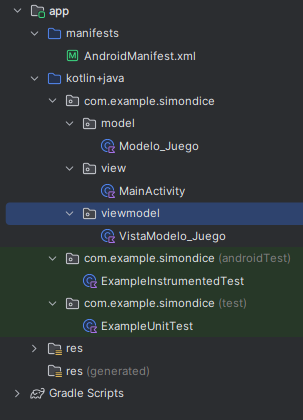

# Proyecto_SimonDice :trollface:
Este proyecto va a tratar como hacer un programa en kotlin basado en el famoso juego "Simon Dice" extendido en gran medida por la empresa de juguetería "Bandai", para ello seguí los siguientes pasos:

    1- Implementación de la estructura MVVM
    2- Explicación de las clases
    3- Explicación del sistema lógico

# 1. Implementación de la estructura MVVM
Para afrontar los problemas estructurales de mi proyecto utilicé el método MVVM para que todo estuviese separado dando modularidad y sincronía a todo el programa, aquí se puede ver un gráfico que representa el modelo MVVM

En mi programa creé tres paquetes para introducir cada parte de la estructura MVVM, un paquete Model, Otro View, y finalmente otro ViewModel, quedando un resultado como este:

# 2. Explicación de las clases
Dentro de cada paquete encontramos la clase que representa cada parte de la estructura, tenemos la clase "Main", "Modelo_Juego", y "VistaModelo_Juego"

## 2.1 Clase "Main" :godmode:
La clase Main funciona como la vista dentro de mi proyecto, aquí se encuentra toda la funcionalidad de lo que se muestra en la pantalla con los siguientes métodos:

    onCreate()
    Crear_Boton()
    Mostrar_Secuencia()
    Entrada_Boton_Presionado()

## 2.2 Clase "Modelo_Juego" :suspect:
La clase "Modelo_Juego" Se va a encargar de conectar la vista con el modelo, comprobando que los datos pasen correctamente de un lugar a otro gracias a sus métodos:

    Iniciar_Nueva_Ronda()
    Comprobar_Secuencia_Jugador()
    Reiniciar_Juego()
    
## 2.3 Clase "VistaModelo_Juego" :hurtrealbad:
La clase "VistaModelo_Juego" se encarga de la funcionakidad del juego en general, creando los datos y retornando aquellos que necesite con los siguientes métodos:

    Ajustes_Nuevo_Juego()
    Ajustes_Nueva_Ronda()
    Ajustes_Secuencia_Jugador()

# 3. Explicación del sistema lógico
El programa en sí debe se basa en 4 botones que se iluminarán dando una secuencia, el jugador debe introducir la secuencia dada que aumenta en 1 cada ronda que pasa.

Mi programa primero desde la main creará la pantalla con los 4 botones, estos deben iluminarse con la secuencia, posteriormente el VistaModelo_Juego comprueba los imput del jugador y los compara al input que da el programa desde Modelo_Juego, si es correcto continua una nueva ronda, si no lo es, acaba la partida y se cierra la app
